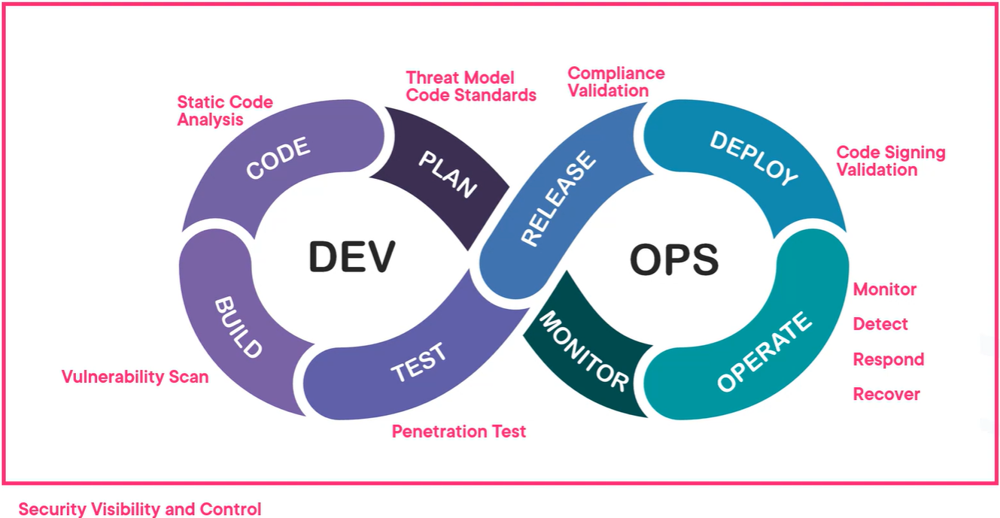
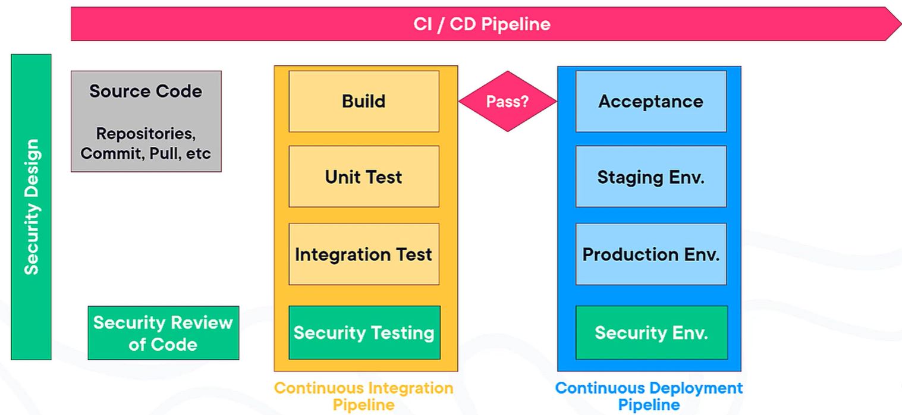
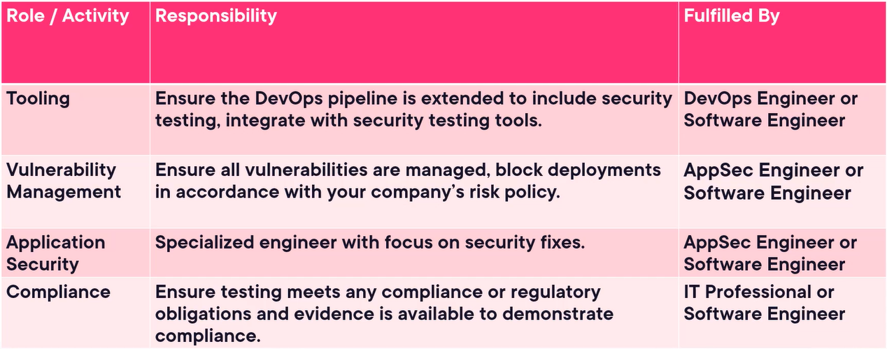
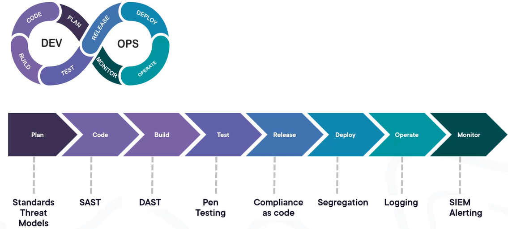
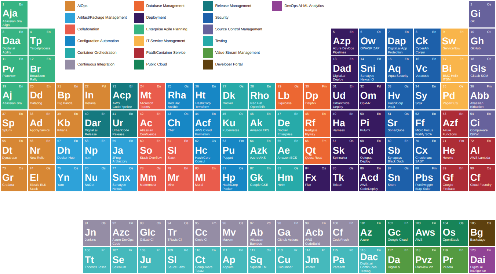

# DevSecOps

## Definition
DevSecOps, short for Development, Security, and Operations, is a framework that integrates security into all phases of the software development lifecycle. It encourages collaboration between developers, security specialists, and operation teams to build software that is efficient and secure. The goal is to address security issues from the start of the project, reducing the risk of deploying code with security vulnerabilities.
https://www.devsecops.org/

## Security as Code
1. `Code Review` becomes `Code Preview`
2. `Patching` becomes `Build new environment and deploy`
3. `Incident response` becomes `Incident Avoidance using Threat Modeling`

## Continuous Integration / Delivery (CI/CD)

## Benefits
1. Reduce time on rework for security vulnerabilities
2. Reduce risk for company and customers
3. Increase team collaboration
4. Consistency in approach, continuous security
5. Increase compliance levels, secure by design (i.e. GDPR)

## Actors

## Designing DevSecOps for Plan, Code and Build SDLC phases
### Threat modelling
Threat model is a process by which potential threats, such as structural vulnerabilities, can be identified, enumerated, and prioritized (from a hypothetical attacker's point of view).
One of the more common threat model is STRIDE:
- Spoofing
- Tampering
- Repudiation
- Information disclosure / leakage
- Denial of Service
- Elevation of privilege

### Secure Code Standards
Follow CMU SEI Top 10:
1. Validate Input
2. Heed compiler warnings
3. Architect and design for security policies
4. Keep it simple
5. Default deny
6. Adhere to the principle of least privilege
7. Sanitize data sent to other systems
8. Practice defense in depth
9. Use effective quality assurance techniques
10. Adopt a secure coding standard
11. Define security requirements
12. Model threats

https://wiki.sei.cmu.edu/confluence/display/seccode/Top%2B10%2BSecure%2BCoding%2BPractices

### Static Code Analysis Testing (SAST), Software Composition Analysis (SCA) and Dynamic Application Security Testing (DAST)
SAST examines source code to identify weaknesses that can lead to security vulnerabilities:
1. Reads source code
2. Language specific scanner
3. False positives
4. Fast and automated
5. Finds weaknesses early

https://www.nist.gov/itl/ssd/software-quality-group/source-code-security-analyzers

SCA checks Open-Source components against known vulnerabilities.
DAST are vulnerability scanners which run on compiled code:

## Designing DevSecOps for Test, Release and Operate SDLC phases

### Test phase
- Penetration Testing (Manual)
- Load Testing (DDoS) putting demand on system to measure response
- Fuzzing (https://owasp.org/www-community/Fuzzing)
- Unit Testing and Integration Testing

### Deploy phase
- SSL Testing (Ensure all Transport Security Layer certificates are valid)
  - Qualys (https://www.qualys.com/)
- Application Hardening (Reducing the attack surface area)
  - CIS Hardened Images

### Operate phase
- Compliance as Code
  - Check against approved baseline, eliminate any deviaton from baseline
- Verification and monitoring
  - Continuous checking that everything is operating as expected

## DevSecOps Tools Periodic Table

https://digital.ai/learn/devsecops-periodic-table/

## Myths
1. DevSecOps is empowered engineering teams taking ownership of how their product performs all the way to production, including security. For this reason, **it's not true that it's necessary a special team dedicated to DevSecOps**.
2. By handing over security checks to other teams we introduce delays and time lag into our agile process, instead we should ask the security team to codify their checks so we can build them into our development process automatically. For this reason, **it's not true that the security team still needs to do all security checks for us**.
3. DevSecOps is not about a capability, it is about a culture, buying a tool is not culture changing. Whilst tools are required to make DevSecOps possible these tools supplement the existing development process and help you deliver DevSecOps, if you have the correct culture in place. For this reason, **it's not true that to do DevSecOps it's enough buying a tool that does it for us**.
4. DevSecOps is about empowering developers to ensure their product gets to production with appropriate security built-in. Traditional approaches to security rrequired testing after developers complete coding and before deployment to production. Because this is so late in the lifecycle it takes longer to fix and retest software compared to identifying the issue at an earlier stage in the lifecycle, so DevSecOps can save time and increase developers speed. For this reason, it's not true that **DevSecOps will just slow down developers**.
5. With DevSecOps developers gain control by running security checks at the best possible opportunity to help developers fix the issues quickly and easily. No longer are developers dependent on external teams, and gain control of the work and schedule. For this reason, it's not true that **DevSecOps will result in our developers giving up control and won't be able to plan**.

# Automated Security Testing Fundamentals
## Static and Dynamic Application Security Testing
While SAST performs static analysis, DAST performs dyamic analysis.
z- SAST are relatively **fast**, analyze code statically.
- DAST are relatively slow, they are vulnerability scanners, fuzzers or attack proxies.

## Test-driven Security
[image test-driven_security](test-driven_security.png)
The advantage of test-driven security is that it forces the team to think of security beforehand.
You need to have a list of security requirements for your application.

## SDLC phases
[image sdlc_automated_security_testing](sdlc_automated_security_testing.png)

Some security checks regarding **code**:
- Hard-coded secrets
- Readability
- Code quality
- Insecure patterns
- Vulnerabilities in third-party libraries

Some security checks regarding **containers**:
- Poisoned images
- Insecure third-party libraries
- Hardening
- Integrity verification

Some security checks regarding **infrastructure**:
- Hardening
- Configuration errors
- Server and network vulnerabilities

### Formatters and Linters
Formatters can help in mantaining a consistent styling, while Linters can be useful in code correctness, best practice and code quality.
Different formatters lead to different results.
Linters are not available for all languages.
#### Python Linkers
- Flake8
- Pylint
- Pylama
- Black
- PyFlakes
- Radon
- pycodestyle
- Mccabe

### Dynamic Application Security Testing
Dynamic Application Security Testing can take a long time, longer than any other security tests.
For this reason, it's important to place it in the correct pipeline.
The result of the test is highly dependent on the used tool.

### Software Composition Analysis
Software that analyze an application for dependencies.
It creates Software Bill of Materials (SBOMs), which can be generated or inferred and it can be used outside of the build pipeline.

### Vulnerability Scanning
A vulnerability is a weakness that can be exploited.
Vulnerability Scanning can be performed outside of the build.
Number of vulnerabilities can be overwhelming.
This tool should download often a list of known vulnerabilities, for instance the National Vulnerability Database, or NVD.
